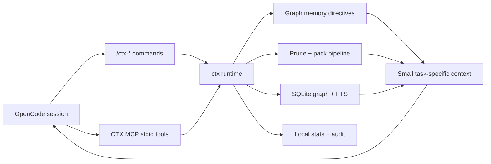

# CTX

**OpenCode-first graph memory and local context runtime for coding agents.**

CTX helps OpenCode work with less prompt noise by turning project rules, code structure, logs, diffs, and task context into a local queryable runtime. Instead of rereading giant markdown instruction files or dumping broad file trees into every prompt, CTX lets the host retrieve the smallest useful slice for the current task.

> Status: CTX is OpenCode-first. The supported daily workflow is to install `ctx`, bootstrap a repo with `ctx opencode install`, then use `/ctx-*` commands from inside OpenCode.

## Contents

- [What CTX Is](#what-ctx-is)
- [Install CTX](#install-ctx)
- [OpenCode-First Usage](#opencode-first-usage)
- [Proof From The Demo Fixture](#proof-from-the-demo-fixture)
- [What Works Today](#what-works-today)
- [How It Works](#how-it-works)
- [Video Demo](#demo-and-screenshots)
- [Security](#security)
- [Documentation](#documentation)
- [Repository Layout](#repository-layout)

## What CTX Is

CTX is a local runtime layer for OpenCode. It indexes the repository, stores reusable project guidance as graph memory, exposes MCP tools, and generates OpenCode commands so the selected OpenCode model can retrieve compact context on demand.

## Why It Exists

Modern coding agents waste context on things that are useful once but expensive forever:

| Problem | Traditional flow | CTX flow |
|---|---|---|
| Project rules | Reread a full `AGENTS.md` repeatedly | Import rules into graph memory and retrieve only relevant directives |
| Noisy logs | Paste thousands of repeated lines | Prune logs into root-cause signal |
| Broad diffs | Feed entire patches | Keep task-relevant hunks and changed symbols |
| Code search | Manual file spelunking | Query local graph, snippets, symbols, and semantic ranking |
| Agent integration | Wrapper commands outside the host | OpenCode-native `/ctx-*` commands and local MCP tools |

CTX is not another agent launcher. OpenCode keeps the selected model, provider, plugins, and normal workflow. CTX sits underneath as a local context layer.

## Install CTX

Current install support:

- macOS Apple Silicon: prebuilt GitHub Release archive
- macOS Intel, Linux, Windows: source install for now

### Fastest Path: macOS Apple Silicon

Download the latest assets from [GitHub Releases](https://github.com/Alegau03/CTX/releases), then run:

```bash
shasum -a 256 -c SHA256SUMS
tar -xzf ctx-0.1.0-aarch64-apple-darwin.tar.gz
mkdir -p "$HOME/.local/bin"
install -m 0755 ctx-0.1.0-aarch64-apple-darwin/ctx "$HOME/.local/bin/ctx"
export PATH="$HOME/.local/bin:$PATH"
```

If you prefer a system-wide install, replace the last two lines with:

```bash
sudo install -m 0755 ctx-0.1.0-aarch64-apple-darwin/ctx /usr/local/bin/ctx
```

### Other Platforms: Source Install

```bash
git clone https://github.com/Alegau03/CTX.git
cd CTX
cargo install --locked --path crates/ctx-cli
```

Verify:

```bash
ctx help
ctx doctor
```

For more install details, including release verification notes, see [docs/install.md](docs/install.md).

## OpenCode-First Usage

Once `ctx` is installed, move into any project and enable CTX:

```bash
cd /path/to/your/project
ctx init
ctx index
ctx opencode install
opencode
```

Inside OpenCode, start with:

```text
/ctx
```

Then use the command center to run `/ctx-doctor`, `/ctx-memory-bootstrap`, `/ctx-memory-search`, `/ctx-plan`, `/ctx-retrieve`, `/ctx-read <file> [mode]`, `/ctx-pack`, `/ctx-compare`, `/ctx-gain`, `/ctx-run <shell command>`, `/ctx-prune-logs <shell command>`, Toolbooks, `/ctx-learn`, and benchmark commands without leaving OpenCode.

For full usage, examples, and expected output, see [guide.md](guide.md).

## Proof From The Demo Fixture

The committed demo benchmark compares a traditional markdown-rule flow against CTX graph memory on `demo/fixtures/opencode-auth-lab`.

| Metric | Result |
|---|---:|
| Markdown rule tokens | `744` |
| Graph memory tokens | `322` |
| Token reduction | `56.72%` |
| Query coverage | `markdown=1.00`, `graph=1.00` |
| Markdown answer success | `33.33%` |
| Graph memory answer success | `100.00%` |
| Quality wins | `markdown=0`, `graph=1`, `ties=0` |

Reproduce it with:

```bash
scripts/demo/opencode-auth-lab-benchmark.sh ./target/debug/ctx
```

Evidence files:

- [benchmark report](demo/fixtures/opencode-auth-lab/benchmarks/report.md)
- [benchmark JSON](demo/fixtures/opencode-auth-lab/benchmarks/report.json)
- [demo walkthrough](docs/demo-walkthrough.md)

The core claim is backed by the included fixture, plus a committed public-repository snapshot.

External validation completed:

- bootstrap, indexing, OpenCode asset generation, MCP handshake, and basic retrieval/pack flow were verified on the public `charmbracelet/glow` repository
- a committed external benchmark snapshot now exists for [agentsmd/agents.md](docs/external-benchmark-agentsmd.md), with:
  - token reduction `72.62%`
  - query coverage `markdown=1.00`, `graph=0.89`
  - success rate `markdown=0.50`, `graph=1.00`
  - quality wins `markdown=0`, `graph=1`, `ties=0`

## What Works Today

| Area | Current state |
|---|---|
| OpenCode integration | `ctx opencode install` writes `opencode.json`, `.opencode/commands/*.md`, and `.opencode/instructions/ctx-host-first.md` |
| Command menu | `/ctx` opens a categorized CTX command center inside OpenCode |
| Graph memory | Bootstrap/import/search/list/get/set/delete/export project directives, including compatibility seeds from `AGENTS.md`, `CLAUDE.md`, `CODEX.md`, and Copilot instructions |
| Planning | `/ctx-plan <task>` combines graph, memory, retrieval, and token-reduced pack signals into an implementation plan |
| Read cache | `/ctx-read <file> [mode]` supports `full`, `outline`, and `digest` reads with session re-read compression for unchanged files |
| Delta-aware indexing | Repeated `ctx index` runs reuse unchanged files, write local cache reports, and avoid reprocessing identical content |
| Context packing | Builds compact task packs with graph, memory, diff, failure, and attachment signals |
| Context comparison | `/ctx-compare <task>` shows before-vs-CTX token density for one task pack |
| Gain reporting | `/ctx-gain` shows recent token savings, biggest wins, and top repeated queries from local stats history |
| Command compression | `/ctx-run <shell command>` runs a local repo command, prunes the noisy output, and keeps the root cause plus raw-log path |
| Toolbooks | OpenCode-only `/ctx-toolbook-*` commands store and search large CLI manuals without putting them in `AGENTS.md` |
| Learning | `/ctx-learn <key> "<body>"` stores reusable project lessons in graph memory |
| Retrieval | Hybrid graph, FTS, snippets, symbols, and semantic ranking with local fallback |
| Pruning | Deterministic log and diff pruning with parser-aware diagnostics |
| MCP | Local stdio MCP plus localhost HTTP JSON-RPC runtime |
| Analysis | Rust, Python, TypeScript, JavaScript, Markdown runbooks, and common config/script files with symbol and dependency enrichment |
| Benchmarks | Markdown-vs-graph memory A/B suite with Markdown and JSON reports |
| Privacy | Local-only defaults, sensitive attachment blocking, and local audit logs |

## How It Works



Core idea: markdown project rules can still exist as seed material, but CTX imports them into graph memory so OpenCode can retrieve only the directives related to the current task.

## Graph Memory

Graph Memory is CTX's structured replacement for repeatedly loading full project-instruction markdown files. It keeps directives local, queryable, editable, and exportable when compatibility requires markdown again.

## Demo And Screenshots

| Asset | Status |
|---|---|
| Fixture project | `demo/fixtures/opencode-auth-lab` is committed |
| Automated smoke | `scripts/demo/opencode-auth-lab-smoke.sh` |
| MCP smoke | `scripts/demo/opencode-auth-lab-mcp-smoke.sh` |
| Benchmark smoke | `scripts/demo/opencode-auth-lab-benchmark.sh` |
| Demo video | [Watch the OpenCode demo video](https://youtu.be/gFwGb7sCzKI) |

Demo Video on OpenCode on a example project:

- [Watch the demo on YouTube](https://youtu.be/gFwGb7sCzKI)


## Security

CTX is local-first by default:

- `local_only = true`
- `remote_upload_enabled = false`
- no mandatory network calls
- `.ctx/graph.db`, `.ctx/packs/`, `.ctx/stats/`, and `.ctx/audit.log` stay local
- sensitive-looking attachments such as `.env`, private keys, credentials, and secret files are blocked by default

See [docs/security.md](docs/security.md).

## Documentation

| File | Purpose |
|---|---|
| [guide.md](guide.md) | Full OpenCode usage guide, command reference, examples, expected outputs |
| [docs/commands.md](docs/commands.md) | Complete CTX command syntax and explanations |
| [docs/install.md](docs/install.md) | Install paths, PATH notes, release archive verification |
| [docs/demo-walkthrough.md](docs/demo-walkthrough.md) | End-to-end fixture validation |
| [docs/demo-script.md](docs/demo-script.md) | Recording/demo sequence |
| [docs/opencode-integration.md](docs/opencode-integration.md) | OpenCode integration architecture |
| [docs/architecture.md](docs/architecture.md) | Runtime architecture |
| [docs/security.md](docs/security.md) | Privacy and trust model |
| [docs/release-playbook.md](docs/release-playbook.md) | Release messaging and checklist |
| [docs/final-qa.md](docs/final-qa.md) | Final QA gate |
| [docs/external-benchmark-agentsmd.md](docs/external-benchmark-agentsmd.md) | Public external benchmark evidence |

## Repository Layout

| Path | Purpose |
|---|---|
| `crates/ctx-cli` | `ctx` binary, OpenCode bootstrap, user-facing CLI commands |
| `crates/ctx-core` | Runtime orchestration for indexing, packing, memory, retrieval, benchmarks |
| `crates/ctx-graph` | SQLite graph, FTS, memory directives, run metadata |
| `crates/ctx-mcp` | Local MCP runtime over stdio and localhost HTTP JSON-RPC |
| `crates/ctx-pack` | Budget-aware context packing and rewriting |
| `crates/ctx-prune` | Log and diff pruning |
| `crates/ctx-ast` | Symbol extraction and code slicing |
| `crates/ctx-semantic` | Semantic ranking and local fallback embedding backend |
| `crates/ctx-telemetry` | Local stats, audit lines, benchmark summaries |
| `demo/fixtures/opencode-auth-lab` | Realistic fixture project for smoke tests and benchmark proof |
| `scripts/demo` | Demo smoke, MCP smoke, and benchmark scripts |
| `scripts/release` | Build, package, verify, and final QA scripts |
