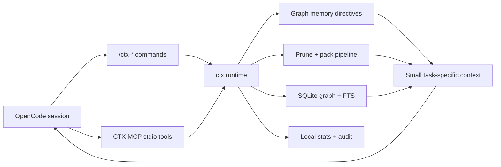

# CTX

**OpenCode-first graph memory and local context runtime for coding agents.**

CTX helps OpenCode work with less prompt noise by turning project rules, code structure, logs, diffs, and task context into a local queryable runtime. Instead of rereading giant markdown instruction files or dumping broad file trees into every prompt, CTX lets the host retrieve the smallest useful slice for the current task.

> Status: CTX is OpenCode-first. The supported daily workflow is to install `ctx`, bootstrap a repo with `ctx opencode install`, then use `/ctx-*` commands from inside OpenCode.

## Contents

- [What CTX Is](#what-ctx-is)
- [Proof From The Demo Fixture](#proof-from-the-demo-fixture)
- [OpenCode-First Usage](#opencode-first-usage)
- [What Works Today](#what-works-today)
- [How It Works](#how-it-works)
- [Demo And Screenshots](#demo-and-screenshots)
- [Security](#security)
- [Documentation](#documentation)
- [Repository Layout](#repository-layout)
- [Roadmap](#roadmap)

## What CTX Is

CTX is a local runtime layer for OpenCode. It indexes the repository, stores reusable project guidance as graph memory, exposes MCP tools, and generates OpenCode commands so the selected OpenCode model can retrieve compact context on demand.

## Why It Exists

Modern coding agents waste context on things that are useful once but expensive forever:

| Problem | Traditional flow | CTX flow |
|---|---|---|
| Project rules | Reread a full `AGENTS.md` repeatedly | Import rules into graph memory and retrieve only relevant directives |
| Noisy logs | Paste thousands of repeated lines | Prune logs into root-cause signal |
| Broad diffs | Feed entire patches | Keep task-relevant hunks and changed symbols |
| Code search | Manual file spelunking | Query local graph, snippets, symbols, and semantic ranking |
| Agent integration | Wrapper commands outside the host | OpenCode-native `/ctx-*` commands and local MCP tools |

CTX is not another agent launcher. OpenCode keeps the selected model, provider, plugins, and normal workflow. CTX sits underneath as a local context layer.

## Proof From The Demo Fixture

The committed demo benchmark compares a traditional markdown-rule flow against CTX graph memory on `demo/fixtures/opencode-auth-lab`.

| Metric | Result |
|---|---:|
| Markdown rule tokens | `744` |
| Graph memory tokens | `180` |
| Token reduction | `75.81%` |
| Markdown answer success | `33.33%` |
| Graph memory answer success | `100.00%` |
| Quality winner | `graph` |

Reproduce it with:

```bash
scripts/demo/opencode-auth-lab-benchmark.sh ./target/debug/ctx
```

Evidence files:

- [benchmark report](demo/fixtures/opencode-auth-lab/benchmarks/report.md)
- [benchmark JSON](demo/fixtures/opencode-auth-lab/benchmarks/report.json)
- [demo walkthrough](docs/demo-walkthrough.md)

The claim is intentionally scoped to the included fixture until broader public benchmark runs are added.

## OpenCode-First Usage

Install from source while the public release/tap is being finalized:

```bash
cargo install --locked --path crates/ctx-cli
```

If `ctx` is not found after install, add Cargo's bin directory to your shell PATH:

```bash
export PATH="$HOME/.cargo/bin:$PATH"
```

Enable CTX in a repository:

```bash
ctx init
ctx index
ctx opencode install
opencode
```

Inside OpenCode, start with:

```text
/ctx
```

Then use the command center to run `/ctx-doctor`, `/ctx-memory-bootstrap`, `/ctx-memory-search`, `/ctx-retrieve`, `/ctx-pack`, `/ctx-prune-logs`, and benchmark commands without leaving OpenCode.

For full usage, examples, and expected output, see [guide.md](guide.md).

## What Works Today

| Area | Current state |
|---|---|
| OpenCode integration | `ctx opencode install` writes `opencode.json`, `.opencode/commands/*.md`, and `.opencode/instructions/ctx-host-first.md` |
| Command menu | `/ctx` opens a categorized CTX command center inside OpenCode |
| Graph memory | Bootstrap/import/search/list/get/set/delete/export project directives |
| Context packing | Builds compact task packs with graph, memory, diff, failure, and attachment signals |
| Retrieval | Hybrid graph, FTS, snippets, symbols, and semantic ranking with local fallback |
| Pruning | Deterministic log and diff pruning with parser-aware diagnostics |
| MCP | Local stdio MCP plus localhost HTTP JSON-RPC runtime |
| Analysis | Rust, Python, TypeScript, and JavaScript symbol extraction and call/dependency enrichment |
| Benchmarks | Markdown-vs-graph memory A/B suite with Markdown and JSON reports |
| Privacy | Local-only defaults, sensitive attachment blocking, and local audit logs |

## How It Works



Core idea: markdown project rules can still exist as seed material, but CTX imports them into graph memory so OpenCode can retrieve only the directives related to the current task.

## Graph Memory

Graph Memory is CTX's structured replacement for repeatedly loading full project-instruction markdown files. It keeps directives local, queryable, editable, and exportable when compatibility requires markdown again.

## Demo And Screenshots

| Asset | Status |
|---|---|
| Fixture project | `demo/fixtures/opencode-auth-lab` is committed |
| Automated smoke | `scripts/demo/opencode-auth-lab-smoke.sh` |
| MCP smoke | `scripts/demo/opencode-auth-lab-mcp-smoke.sh` |
| Benchmark smoke | `scripts/demo/opencode-auth-lab-benchmark.sh` |
| Screenshots | To be added under `docs/assets/` after manual OpenCode validation |
| Demo video | To be recorded after final real-repo validation |

Planned video flow is documented in [docs/demo-script.md](docs/demo-script.md).

## Security

CTX is local-first by default:

- `local_only = true`
- `remote_upload_enabled = false`
- no mandatory network calls
- `.ctx/graph.db`, `.ctx/packs/`, `.ctx/stats/`, and `.ctx/audit.log` stay local
- sensitive-looking attachments such as `.env`, private keys, credentials, and secret files are blocked by default

See [docs/security.md](docs/security.md).

## Documentation

| File | Purpose |
|---|---|
| [guide.md](guide.md) | Full OpenCode usage guide, command reference, examples, expected outputs |
| [docs/install.md](docs/install.md) | Install paths, PATH notes, release archive verification |
| [docs/demo-walkthrough.md](docs/demo-walkthrough.md) | End-to-end fixture validation |
| [docs/demo-script.md](docs/demo-script.md) | Recording/demo sequence |
| [docs/opencode-integration.md](docs/opencode-integration.md) | OpenCode integration architecture |
| [docs/architecture.md](docs/architecture.md) | Runtime architecture |
| [docs/security.md](docs/security.md) | Privacy and trust model |
| [docs/release-playbook.md](docs/release-playbook.md) | Release messaging and checklist |
| [docs/final-qa.md](docs/final-qa.md) | Final QA gate |
| [roadmap](docs/superpowers/plans/2026-04-25-final-release-roadmap.md) | Current release roadmap |

## Repository Layout

| Path | Purpose |
|---|---|
| `crates/ctx-cli` | `ctx` binary, OpenCode bootstrap, user-facing CLI commands |
| `crates/ctx-core` | Runtime orchestration for indexing, packing, memory, retrieval, benchmarks |
| `crates/ctx-graph` | SQLite graph, FTS, memory directives, run metadata |
| `crates/ctx-mcp` | Local MCP runtime over stdio and localhost HTTP JSON-RPC |
| `crates/ctx-pack` | Budget-aware context packing and rewriting |
| `crates/ctx-prune` | Log and diff pruning |
| `crates/ctx-ast` | Symbol extraction and code slicing |
| `crates/ctx-semantic` | Semantic ranking and local fallback embedding backend |
| `crates/ctx-telemetry` | Local stats, audit lines, benchmark summaries |
| `demo/fixtures/opencode-auth-lab` | Realistic fixture project for smoke tests and benchmark proof |
| `scripts/demo` | Demo smoke, MCP smoke, and benchmark scripts |
| `scripts/release` | Build, package, verify, and final QA scripts |

## Roadmap

Completed:

- OpenCode-native repo bootstrap
- OpenCode `/ctx-*` command surface
- graph memory CRUD, markdown bootstrap, and benchmark proof
- parser-aware pruning and richer pack inputs
- local MCP stdio/HTTP runtime
- release archive build and verification scripts

Remaining before a public GitHub launch:

- add screenshots and recorded demo assets after manual validation
- run the benchmark on at least one real external repository
- finalize public release coordinates, repository URL, and Homebrew tap metadata
- polish the first GitHub release notes with reproducible demo evidence
